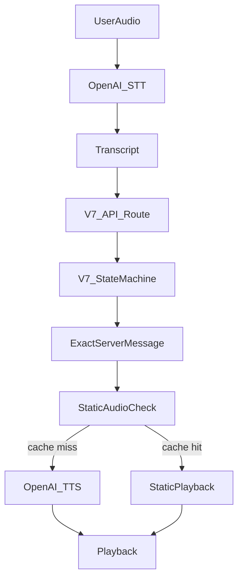

# PRD: V7 OpenAI Speech I/O

**Date**: April 15, 2026
**Status**: Draft
**Priority**: High - therapeutic fidelity, speech architecture, and doctor-script compliance
**Output**: A production-ready **V7** speech path that can use OpenAI for transcription and text-to-speech while preserving doctor-authored wording and keeping the existing V7 treatment engine as the source of truth.

---

## 1. Background

V7 already has a treatment architecture that is largely deterministic and script-driven. The treatment flow is defined by the V7 state machine and modality files, while the voice layer operates as an interface that captures speech, submits user input, and plays back the returned message.

This creates a plausible path for introducing OpenAI into the speech loop, but only if the integration respects the current architectural separation:

1. **The treatment engine owns progression.**
2. **Doctor-authored verbiage remains authoritative.**
3. **Speech infrastructure may transcribe and vocalize, but must not author therapeutic content.**

The repository also already contains experimental OpenAI voice work in Labs, which shows that OpenAI voice tooling can be integrated technically. However, those experiments do not by themselves establish production suitability for a treatment flow that must remain tightly aligned with doctor-authored text.

---

## 2. Product Objective

Enable V7 to use OpenAI for speech input/output under a strict-script operating model:

1. **Use OpenAI transcription** as an optional speech-to-text provider
2. **Use OpenAI text-to-speech** as an optional dynamic playback provider
3. **Keep V7 as the treatment brain** for all step progression and patient-facing messaging
4. **Prevent OpenAI from becoming the therapeutic author** of the session

This is explicitly not a project to make ChatGPT the free-form conversational orchestrator of treatment sessions.

---

## 3. Recommendation

This initiative is viable only under a constrained architecture:

1. **Keep the V7 treatment engine as the source of truth** for all treatment progression and all patient-facing prompts
2. **Use OpenAI only for speech I/O** in the initial implementation
3. **Do not allow a generative voice model to control treatment progression or improvise therapeutic wording**

The recommended production architecture is:

---

## 4. Why This Is Viable

V7 already separates treatment logic from voice delivery.

### Existing V7 treatment control

The most important treatment behavior already lives in:

- `lib/v7/base-state-machine.ts`
- `app/api/treatment-v7/route.ts`
- `lib/v7/treatment-modalities/`
- `lib/v7/types.ts`

These files define:

- the current step
- the next step
- the response validation
- the patient-facing scripted response
- when AI is allowed to assist or classify

### Existing V7 voice integration

The UI already speaks the server-returned message through:

- `components/treatment/v7/TreatmentSession.tsx`
- `components/voice/useNaturalVoice.tsx`
- `app/api/tts/route.ts`

That means the system already has a clean seam where speech delivery can be swapped without changing the treatment engine.

### Existing OpenAI groundwork

The repo already contains:

- OpenAI TTS support in `app/api/tts/route.ts`
- OpenAI Realtime session setup in `app/api/labs/openai-session/route.ts`
- OpenAI voice experiments in `components/labs/OpenAIVoiceDemo.tsx`
- exact-script voice experiments in `components/labs/VoiceTreatmentDemo.tsx`

So the question is no longer whether OpenAI can be connected technically. The real question is whether it can be connected without weakening the treatment protocol. Under a strict speech-I/O-only design, the answer is yes.

---

## 5. Non-Negotiable Constraints

1. **Exact doctor-authored prompts must come from V7.** OpenAI must not generate alternative therapeutic wording for core prompts.
2. **Internal routing tokens must never be spoken.** Signals such as `PROBLEM_SELECTION_CONFIRMED`, `METHOD_SELECTION_NEEDED`, and transition markers are control tokens, not patient-facing audio.
3. **The final spoken text must equal the final server message.** Playback must use the exact `message` returned by `app/api/treatment-v7/route.ts`.
4. **Static audio must remain text-locked.** Existing preload and caching behavior depends on exact string matches in `lib/v7/static-audio-texts.ts` and `components/treatment/v7/V7AudioPreloader.tsx`.
5. **OpenAI may classify or transcribe, but not become the therapeutic author.**
6. **Any AI-assisted wording drift in V7 must be reviewed and constrained before rollout.**

---

## 6. Current Risks In V7

V7 is close to being compatible with this model, but not fully strict yet.

### A. Linguistic-processing drift

In `app/api/treatment-v7/route.ts`, the `needsLinguisticProcessing` path can alter parts of the final returned text. That may be acceptable for tightly controlled placeholder substitution, but it conflicts with a strong exact-wording interpretation if left unconstrained.

### B. Placeholder AI assistance context

In the same route, `handleAIAssistance(...)` currently builds assistance requests with placeholder phase/step/context values. That means any AI help for stuck-user scenarios is not fully grounded in the real live session context.

### C. Transcription sensitivity in selection steps

The introduction and method-selection flows rely on short utterances and text matching patterns. That means speech-to-text errors could misroute the session if the transcription path regresses.

### D. Static audio mismatch risk

Some prompts are pre-generated and cached. If runtime wording changes, the system may fall off the static-audio path and increase latency and cost, or create hidden wording divergence.

---

## 7. Scope

### In Scope

- OpenAI transcription as an optional STT provider for V7
- OpenAI TTS as an optional dynamic playback provider for V7
- Strict guards ensuring only final user-facing V7 messages are spoken
- Auditing and constraining wording-drift paths in V7
- Verification that OpenAI speech does not alter treatment progression
- Maintaining static-audio-first playback where possible

### Out of Scope

- Replacing the V7 treatment engine with ChatGPT
- Allowing generative voice models to improvise therapeutic prompts
- Rewriting the treatment protocol into a Realtime prompt-only system
- Replacing static audio with fully generative audio for all prompts
- Re-architecting Labs beyond what is needed for validation and pilot testing

---

## 8. Milestone 1 - Lock The Compliance Boundary

### Goal

Define and enforce the rule that V7 owns treatment wording and progression, while OpenAI only supports speech delivery and approved helper tasks.

### Problem Being Solved

Without a hard boundary, the system could gradually drift into a model where transcription, clarification, linguistic processing, and audio synthesis all blur together and reduce auditability.

### Required Deliverables

1. A clear list of all patient-facing wording sources in V7
2. A classification of every AI-assisted branch as:
   - allowed classifier
   - allowed tightly constrained rewrite
   - disallowed generative rewrite
3. A strict rule that only final user-facing `message` strings are eligible for speech playback

### Key Files

- `lib/v7/base-state-machine.ts`
- `app/api/treatment-v7/route.ts`
- `lib/v7/treatment-modalities/`
- `lib/v2/ai-assistance.ts`

### Acceptance Criteria

1. Every V7 wording source is identified
2. Every AI-assisted path is classified
3. The allowed vs disallowed AI behavior is explicit and testable

---

## 9. Milestone 2 - Tighten V7 Before OpenAI Cutover

### Goal

Remove or constrain V7 behaviors that would violate strict-script delivery.

### Required Deliverables

1. Review `needsLinguisticProcessing` and decide which uses are permitted in strict mode
2. Fix `handleAIAssistance(...)` so any allowed assistance uses the real current session context
3. Add safeguards preventing internal routing tokens from reaching playback

### Key Files

- `app/api/treatment-v7/route.ts`
- `lib/v7/base-state-machine.ts`
- `lib/v7/validation-helpers.ts`
- `lib/v2/ai-assistance.ts`

### Acceptance Criteria

1. No uncontrolled wording rewrite remains in strict mode
2. No internal control token can be rendered or spoken
3. Any retained AI assistance is fully context-grounded or disabled in strict mode

---

## 10. Milestone 3 - Add OpenAI Transcription

### Goal

Introduce OpenAI as an optional speech-to-text backend without changing the treatment contract.

### Problem Being Solved

The voice layer should be able to use OpenAI STT while preserving the current turn model:

- user speaks
- transcript is collected
- transcript is sent to V7
- V7 returns the exact patient-facing message

### Required Deliverables

1. A new `openai` transcription provider path
2. Preservation of current transcript aggregation and flush timing
3. Preservation of step-aware transcription context and hotword biasing where possible

### Key Files

- `components/voice/useNaturalVoice.tsx`
- `components/voice/useAudioCapture.ts`
- `app/api/transcribe/route.ts`
- `lib/voice/transcription-domain-context.ts`
- `components/treatment/v7/TreatmentSession.tsx`

### Acceptance Criteria

1. OpenAI transcription can be enabled by configuration or feature flag
2. V7 session routing does not regress on representative flows
3. Work-type selection, problem capture, and modality routing remain reliable

---

## 11. Milestone 4 - Add OpenAI TTS For Dynamic Playback

### Goal

Use OpenAI TTS as a controlled playback path for dynamic prompts while preserving exact server wording.

### Required Deliverables

1. Provider support for OpenAI TTS in the V7 voice path
2. Exact-text synthesis from the final server `message`
3. Continued preference for static audio when an exact cached segment exists

### Key Files

- `app/api/tts/route.ts`
- `components/voice/useNaturalVoice.tsx`
- `components/treatment/v7/TreatmentSession.tsx`
- `lib/v7/static-audio-texts.ts`
- `components/treatment/v7/V7AudioPreloader.tsx`

### Acceptance Criteria

1. Dynamic prompts can be spoken via OpenAI TTS
2. Static audio remains the first choice for fixed prompts
3. Spoken text exactly matches the server-returned `message`

---

## 12. Milestone 5 - Verification And Parity Guard

### Goal

Prove that introducing OpenAI speech does not change treatment behavior or spoken wording.

### Required Deliverables

1. Turn-level checks that spoken text equals the exact V7 API `message`
2. Regression checks that internal tokens are never spoken
3. Representative flow verification across:
   - introduction and work-type selection
   - problem path
   - goal path
   - trauma path
   - integration path
4. Validation of:
   - text-only mode
   - static-audio hit path
   - OpenAI TTS fallback path
   - OpenAI transcription path

### Suggested Files

- `tests/helpers/api-client.ts`
- `tests/helpers/test-flows.ts`
- any V7-specific parity or speech verification harness added for this work

### Acceptance Criteria

1. No spoken-output mismatch between playback text and server `message`
2. No routing regressions on covered flows
3. No internal control-token leakage
4. Strict mode is demonstrably auditable

---

## 13. Realtime Positioning

OpenAI Realtime is relevant, but it should not be the first production architecture for this work.

### Recommendation

1. **Ship first with standard OpenAI STT/TTS over the current request-response model**
2. **Keep Realtime as a later optimization path for latency experiments**
3. **If Realtime is used later, it must remain a transport/interface layer rather than a treatment author**

### Why

Realtime is more complex to control and audit in a therapy-style protocol because it naturally pushes toward conversational generation. That makes it harder to prove strict compliance with doctor-authored wording.

The Labs work is useful as reference material, but not sufficient justification for making Realtime the primary production path for V7 treatment sessions.

---

## 14. Success Criteria

This PRD succeeds when all of the following are true:

1. V7 can use OpenAI speech services without changing treatment progression
2. Every patient-facing spoken prompt in strict mode matches the exact final V7 server `message`
3. No internal routing token is spoken or shown as patient-facing content
4. Static audio continues to serve exact fixed prompts where available
5. OpenAI TTS cleanly covers exact-text dynamic prompts
6. OpenAI transcription quality is good enough not to regress critical routing moments
7. Any retained AI assistance paths are approved, bounded, and context-grounded

---

## 15. Main Risks

1. Existing linguistic-processing branches may violate the exact-wording requirement unless constrained
2. STT transcription errors may misroute short selection-style turns
3. Dynamic prompts that interpolate user wording need clear rules for what counts as acceptable exactness
4. Realtime may be tempting for latency, but adopting it too early increases compliance and observability risk

---

## 16. Delivery Sequence

1. Audit V7 wording ownership and AI drift points
2. Lock down strict-mode rules
3. Add OpenAI TTS as the controlled dynamic-output path
4. Add OpenAI transcription behind a feature flag
5. Add strict playback safeguards and verification
6. Pilot in a controlled environment
7. Only after parity is proven, evaluate optional Realtime experiments
